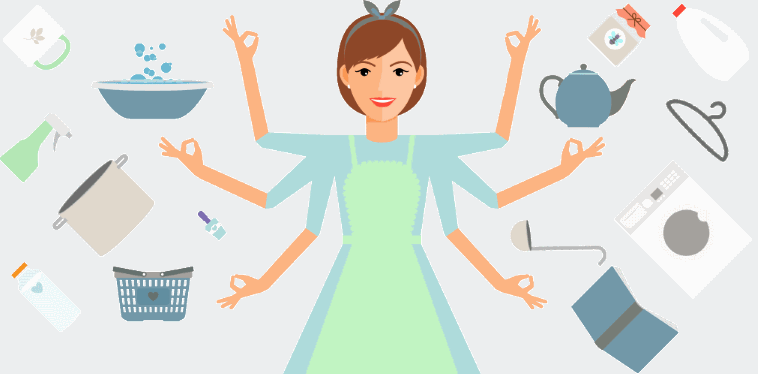

Ideally we all have enough free time in our life for leisure, pursuits beyond those driven by survival that bring us joy. The more time we spend in the upkeep of our daily living the more precious our free time is. While it is no surprise that more free time helps people to be happy, what may be surprising is that buying free time actually makes people happier.

An international research team led by Harvard Professor <a href="https://www.hbs.edu/faculty/Pages/profile.aspx?facId=943704&facInfo=pub" target="_blank">Ashley V. Whillans</a> analyzed survey data from 4,500 people from the Canada, Denmark the Netherlands and United States. Survey takers were asked if they delegated daily tasks to others in order to free more of their own time. 

> In 28% of cases, the answer was yes. These folks spent an average of $147.95 per month to buy themselves extra time.

> What they lost in currency, they made up for in happiness. Whillans and her colleagues found that the people who traded money for time were more satisfied with 
> life than their counterparts who didn't. They also were less likely to say they felt "time stress," a condition that was linked with lower levels of 
> life satisfaction. (Kaplan)

The researchers also determined "that people from across the income spectrum benefitted from buying time"(Whillans) -- the benefits that come from maximizing free time aren't associated with being affluent, anyone can benefit. We built our company, <a href="https://domesticMercenaries.com/" target="_blank">Domestic Mercenaries</a>, around this concept -- providing our customers with more time.

## How Domestic Mercenaries Helps
Our customers delegate the overhead of domestic upkeep (cleaning, laundry, grocery shopping and cooking) to us in order to spend that time how they want. We have a simple, flexible pricing structure that scales. For instance our providers can work until job completion (ie 'as long as it takes') or for a set duration (ie 'two hours'). Additionally we can aggregate multiple services -- for example when arriving to clean a home, bringing a bag of groceries and the dry cleaning as well. This allows our customers to schedule and pay once for a service that efficiently delivers multiple returns.

On the other hand we also provide ala carte services. For instance a customer can hire **just** home cleaning, or laundry service. If they need a one-time helping hand for a dinner party we can help with that, too. This makes it convenient to pay for just what is wanted, while allowing scalability when desired.

A main goal of <a href="https://domesticMercenaries.com/" target="_blank">Domestic Mercenaries</a> is to simplify the process of delegation. That's why you can schedule all of our services online from <a href="https://domesticMercenaries.com/" target="_blank">our website</a>, <a href="https://www.facebook.com/DomesticMercenaries/" target="_blank">Facebook</a> or even <a href="https://www.instagram.com/domesticmercy/" target="_blank">Instagram</a>. We don't have an app you need to download - after scheduling our services, confirmation, communication and invoicing happens over text with your mobile phone; however, we also also have a telephone number and are available on <a href="https://m.me/DomesticMercenaries" target="_blank">Facebook Messenger</a> if you prefer either of those options, instead. <a href="https://domesticMercenaries.com/Contact" target="_blank">Come say hello!</a> 

We are excited at the opportunity to add value to the lives of our customers -- and additional happiness too.

***

###### Whillans, Ashley V. et al. “Buying time promotes happiness.” *Proceedings of the National Academy of Sciences of the United States of America*, August 8, 2017. 114 (32) 8523-8527; published ahead of print July 24, 2017, http://www.pnas.org/content/114/32/8523. Accessed 25 May 2018.

###### Kaplan, Karen. "Science proves it: Money really can buy happiness." Los Angeles Times, http://www.latimes.com/science/sciencenow/la-sci-sn-money-time-happiness-20170724-story.html. Accessed 25 May 2018.
